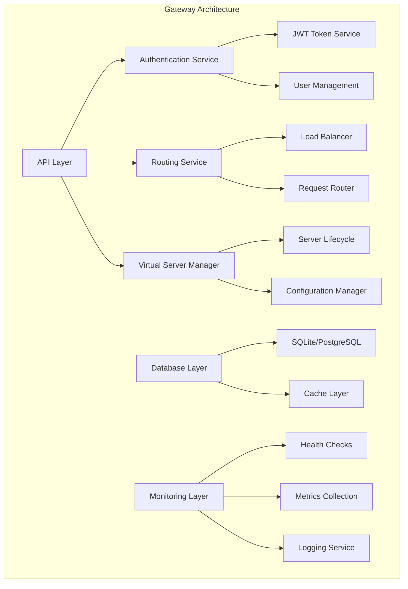
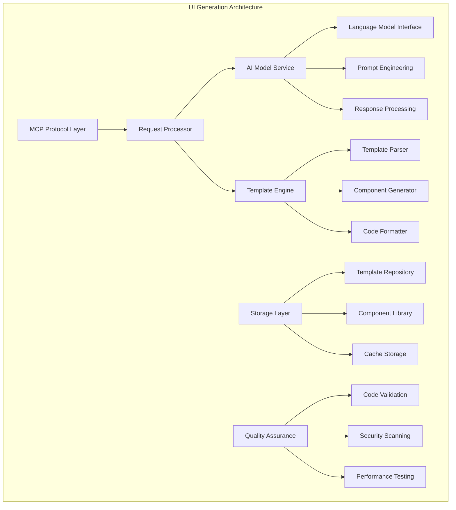
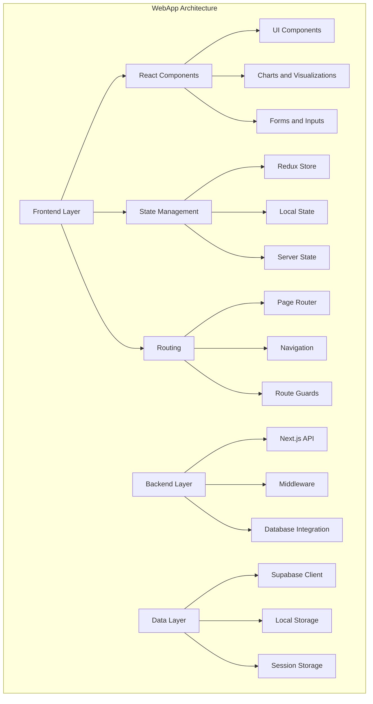
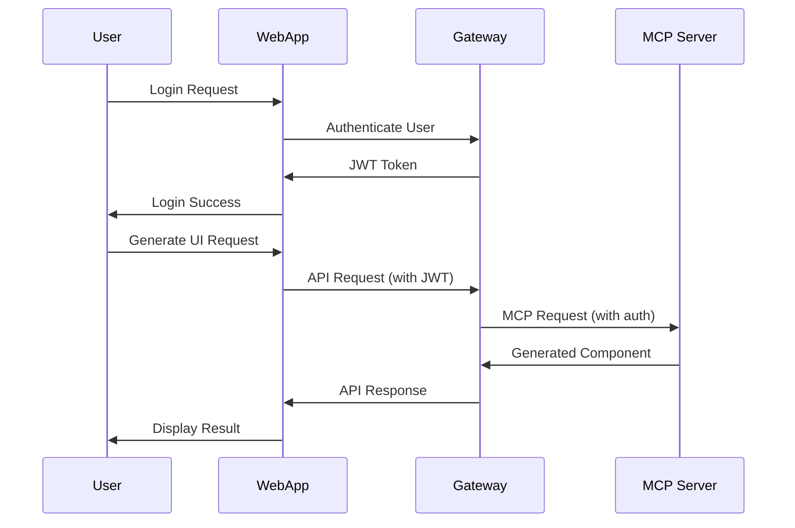
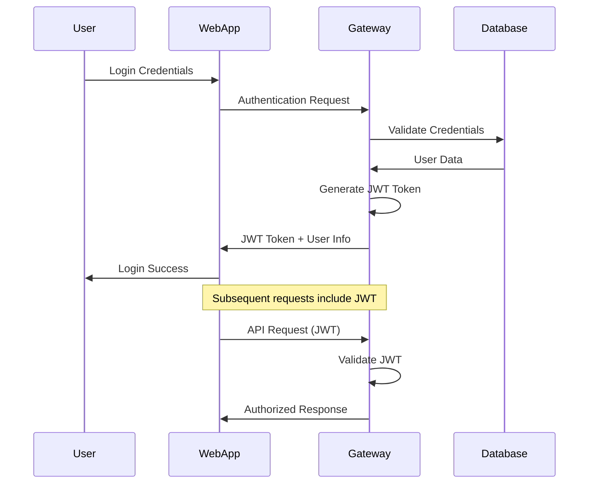
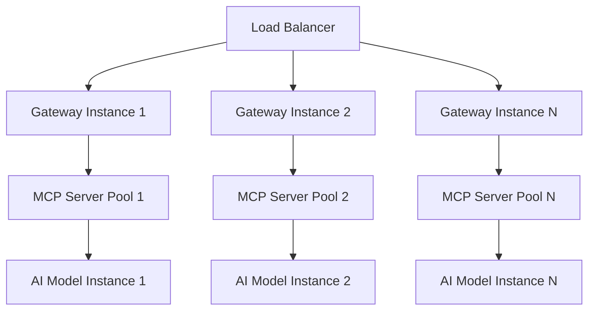

# UIForge Ecosystem Architecture

## 🏗️ **System Architecture Overview**

The UIForge ecosystem follows a **hub-and-spoke architecture** with the forge-mcp-gateway as the central hub and specialized MCP servers as spokes. This design enables centralized management while maintaining modularity and extensibility.

### **Architectural Principles**

1. **Centralized Coordination**: Gateway manages authentication, routing, and orchestration
2. **Specialized Services**: Each MCP server focuses on specific capabilities
3. **Loose Coupling**: Components communicate through well-defined APIs
4. **High Cohesion**: Related functionality grouped within components
5. **Scalable Design**: Stateless services enable horizontal scaling

## 🔄 **Component Architecture**

### **forge-mcp-gateway (Central Hub)**



#### **Gateway Components**

**API Layer**
- **RESTful API**: HTTP/JSON interface for webapp and external clients
- **MCP Protocol**: Native MCP server communication
- **WebSocket**: Real-time communication for live updates
- **GraphQL**: Flexible query interface for complex data requirements

**Authentication Service**
- **JWT Token Management**: Token generation, validation, and refresh
- **User Authentication**: Login, logout, and session management
- **Authorization**: Role-based access control (RBAC)
- **Security Policies**: Rate limiting, CORS, and security headers

**Routing Service**
- **Request Routing**: Intelligent routing to appropriate MCP servers
- **Load Balancing**: Distribution of requests across server instances
- **Circuit Breaker**: Fault tolerance and automatic failover
- **Request Transformation**: Protocol translation and format conversion

**Virtual Server Manager**
- **Server Lifecycle**: Start, stop, restart MCP servers
- **Configuration Management**: Dynamic configuration updates
- **Health Monitoring**: Server health checks and status tracking
- **Resource Management**: CPU, memory, and network resource allocation

### **uiforge-mcp (UI Generation Server)**



#### **UI Generation Components**

**MCP Protocol Layer**
- **MCP Server**: Standard MCP protocol implementation
- **Custom Extensions**: UI-specific MCP extensions
- **Message Handling**: Request/response processing
- **Error Handling**: Comprehensive error management

**AI Model Service**
- **Model Interface**: Abstraction layer for AI models
- **Prompt Engineering**: Optimized prompts for UI generation
- **Response Processing**: AI output parsing and validation
- **Model Management**: Model selection and configuration

**Template Engine**
- **Template Parser**: Parse and validate template syntax
- **Component Generator**: Generate UI components from templates
- **Code Formatter**: Format generated code according to standards
- **Framework Adapters**: Support for multiple UI frameworks

### **uiforge-webapp (Management Interface)**



#### **WebApp Components**

**Frontend Layer**
- **React Components**: Modern React with hooks and functional components
- **State Management**: Redux for global state, local state for components
- **Routing**: Next.js routing with dynamic routes and guards
- **UI Framework**: Tailwind CSS with custom design system

**Backend Layer**
- **Next.js API**: Server-side API routes and middleware
- **Authentication**: JWT token handling and user sessions
- **API Integration**: Communication with gateway and external services
- **Data Processing**: Business logic and data transformation

**Data Layer**
- **Supabase**: PostgreSQL database with real-time capabilities
- **Local Storage**: Client-side data persistence
- **Session Storage**: Temporary session data
- **Caching**: Intelligent caching for performance

## 🔗 **Integration Architecture**

### **Communication Patterns**



### **API Contracts**

#### **WebApp ↔ Gateway API**
```typescript
// Authentication API
POST /api/auth/login
POST /api/auth/logout
POST /api/auth/refresh
GET  /api/auth/profile

// UI Generation API
POST /api/generate/component
GET  /api/generate/status/:id
GET  /api/generate/history

// Configuration API
GET  /api/config/templates
POST /api/config/templates
PUT  /api/config/templates/:id
DELETE /api/config/templates/:id

// Monitoring API
GET  /api/health/status
GET  /api/metrics/performance
GET  /api/logs/events
```

#### **Gateway ↔ MCP Server Protocol**
```typescript
// MCP Tool Calls
{
  "method": "tools/call",
  "params": {
    "name": "generate_ui_component",
    "arguments": {
      "description": "user input description",
      "framework": "react",
      "style": "modern",
      "options": {...}
    }
  }
}

// MCP Server Responses
{
  "result": {
    "component": {
      "code": "generated React component",
      "metadata": {
        "framework": "react",
        "dependencies": ["@mui/material"],
        "preview": "base64 image"
      }
    }
  }
}
```

## 🗄️ **Data Architecture**

### **Database Schema**

#### **Gateway Database**
```sql
-- Users and Authentication
CREATE TABLE users (
    id UUID PRIMARY KEY,
    email VARCHAR(255) UNIQUE NOT NULL,
    password_hash VARCHAR(255) NOT NULL,
    created_at TIMESTAMP DEFAULT NOW(),
    updated_at TIMESTAMP DEFAULT NOW()
);

-- Virtual Servers
CREATE TABLE virtual_servers (
    id UUID PRIMARY KEY,
    name VARCHAR(255) NOT NULL,
    type VARCHAR(100) NOT NULL,
    status VARCHAR(50) DEFAULT 'stopped',
    config JSONB,
    created_at TIMESTAMP DEFAULT NOW(),
    updated_at TIMESTAMP DEFAULT NOW()
);

-- Server Instances
CREATE TABLE server_instances (
    id UUID PRIMARY KEY,
    server_id UUID REFERENCES virtual_servers(id),
    instance_id VARCHAR(255) NOT NULL,
    status VARCHAR(50) DEFAULT 'stopped',
    metrics JSONB,
    created_at TIMESTAMP DEFAULT NOW()
);
```

#### **WebApp Database (Supabase)**
```sql
-- Projects
CREATE TABLE projects (
    id UUID PRIMARY KEY,
    user_id UUID REFERENCES auth.users(id),
    name VARCHAR(255) NOT NULL,
    description TEXT,
    settings JSONB,
    created_at TIMESTAMP DEFAULT NOW(),
    updated_at TIMESTAMP DEFAULT NOW()
);

-- Generated Components
CREATE TABLE generated_components (
    id UUID PRIMARY KEY,
    project_id UUID REFERENCES projects(id),
    name VARCHAR(255) NOT NULL,
    code TEXT NOT NULL,
    framework VARCHAR(100),
    metadata JSONB,
    created_at TIMESTAMP DEFAULT NOW()
);

-- Templates
CREATE TABLE templates (
    id UUID PRIMARY KEY,
    name VARCHAR(255) NOT NULL,
    description TEXT,
    category VARCHAR(100),
    template_code TEXT NOT NULL,
    framework VARCHAR(100),
    created_at TIMESTAMP DEFAULT NOW()
);
```

### **Data Flow Patterns**

#### **Request Processing Flow**
1. **Request Reception**: API layer receives HTTP request
2. **Authentication**: JWT token validation and user identification
3. **Authorization**: Permission check for requested operation
4. **Routing**: Request routed to appropriate service
5. **Processing**: Business logic execution
6. **Response**: Result formatted and returned

#### **Event-Driven Architecture**
```typescript
// Event Types
interface SystemEvent {
  type: 'user.login' | 'server.start' | 'component.generated';
  payload: any;
  timestamp: Date;
  userId?: string;
  metadata?: any;
}

// Event Handlers
class EventHandler {
  onUserLogin(event: SystemEvent) {
    // Update user activity, log event, etc.
  }
  
  onServerStart(event: SystemEvent) {
    // Update server status, notify monitoring, etc.
  }
  
  onComponentGenerated(event: SystemEvent) {
    // Store component, update metrics, etc.
  }
}
```

## 🔒 **Security Architecture**

### **Authentication Flow**


### **Security Layers**
1. **Network Security**: HTTPS, TLS encryption, firewall rules
2. **Application Security**: JWT authentication, RBAC, input validation
3. **Data Security**: Encryption at rest, secure key management
4. **Infrastructure Security**: Container security, secrets management

## 📊 **Monitoring & Observability**

### **Metrics Architecture**
```typescript
// System Metrics
interface SystemMetrics {
  cpu: {
    usage: number;
    load_average: number[];
  };
  memory: {
    used: number;
    total: number;
    available: number;
  };
  network: {
    requests_per_second: number;
    response_time: number;
    error_rate: number;
  };
}

// Application Metrics
interface ApplicationMetrics {
  users: {
    active: number;
    total: number;
    new_registrations: number;
  };
  components: {
    generated_per_hour: number;
    success_rate: number;
    average_generation_time: number;
  };
  servers: {
    active_instances: number;
    health_status: 'healthy' | 'degraded' | 'unhealthy';
  };
}
```

### **Logging Architecture**
```typescript
// Log Structure
interface LogEntry {
  timestamp: Date;
  level: 'debug' | 'info' | 'warn' | 'error';
  service: string;
  message: string;
  context?: any;
  userId?: string;
  requestId?: string;
}

// Log Aggregation
class LogAggregator {
  collectLogs(service: string, timeRange: TimeRange): LogEntry[] {
    // Collect logs from all services
  }
  
  searchLogs(query: LogQuery): LogEntry[] {
    // Search logs across all services
  }
  
  getMetrics(timeRange: TimeRange): LogMetrics {
    // Generate metrics from logs
  }
}
```

## 🚀 **Performance Architecture**

### **Caching Strategy**
```typescript
// Multi-Level Caching
interface CacheStrategy {
  // L1: In-memory cache (fastest)
  memory: {
    ttl: 300; // 5 minutes
    maxSize: 1000;
  };
  
  // L2: Redis cache (fast)
  redis: {
    ttl: 3600; // 1 hour
    cluster: true;
  };
  
  // L3: Database cache (persistent)
  database: {
    ttl: 86400; // 24 hours
    compression: true;
  };
}
```

### **Load Balancing**


## 🔄 **Scalability Architecture**

### **Horizontal Scaling**
- **Stateless Services**: All services designed to be stateless
- **Database Sharding**: Horizontal partitioning for large datasets
- **Microservices**: Independent scaling of service components
- **Container Orchestration**: Kubernetes-based deployment and scaling

### **Auto-Scaling Policies**
```yaml
# Kubernetes HPA Example
apiVersion: autoscaling/v2
kind: HorizontalPodAutoscaler
metadata:
  name: gateway-hpa
spec:
  scaleTargetRef:
    apiVersion: apps/v1
    kind: Deployment
    name: gateway
  minReplicas: 2
  maxReplicas: 10
  metrics:
  - type: Resource
    resource:
      name: cpu
      target:
        type: Utilization
        averageUtilization: 70
  - type: Resource
    resource:
      name: memory
      target:
        type: Utilization
        averageUtilization: 80
```

## 📚 **Architecture Documentation**

- [Architecture Decision Records](../architecture-decisions/)
- [Integration Guide](./INTEGRATION_GUIDE.md)
- [Security Architecture](../standards/SECURITY.md)
- [Deployment Architecture](./DEPLOYMENT_PLAYBOOK.md)
- [Development Standards](../standards/DEVELOPMENT.md)

---

*This architecture document provides the technical foundation for understanding how the UIForge ecosystem components work together. For implementation details, please refer to the specific project documentation.*