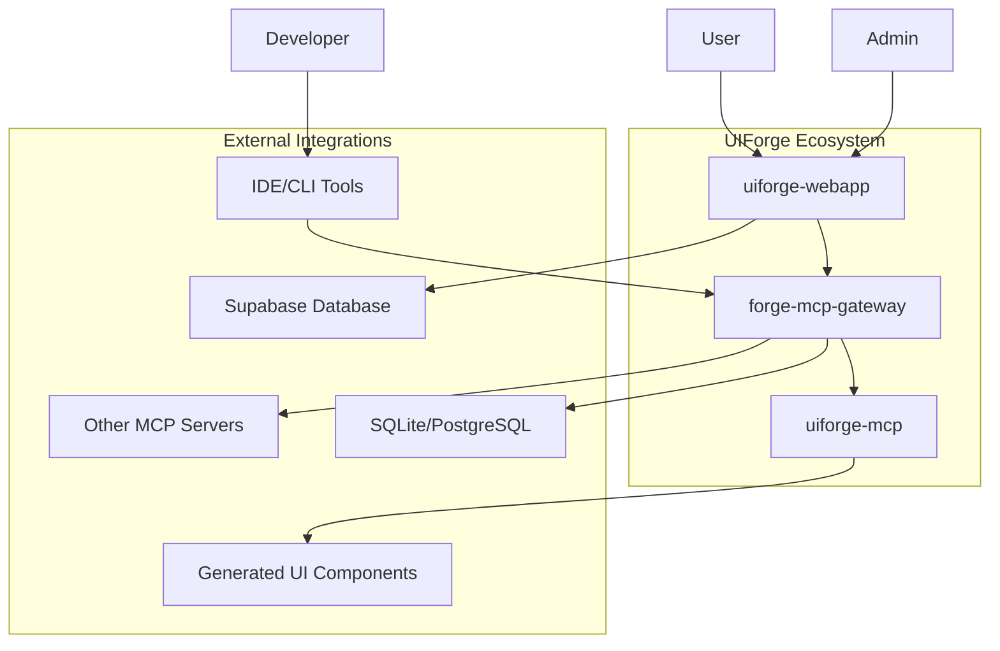

# UIForge Ecosystem Overview

## 🎯 **Ecosystem Vision: Unified AI-Powered UI Generation Platform**

The UIForge ecosystem consists of three integrated components that work together
to provide a comprehensive AI-powered UI generation platform:

- **forge-mcp-gateway**: Central hub for aggregation, routing, and
  authentication
- **uiforge-mcp**: Specialized MCP server for UI generation and template
  management
- **uiforge-webapp**: Management interface for configuration and monitoring

## 🏗️ **System Architecture**

### **Component Integration Diagram**



### **Component Responsibilities**

#### **forge-mcp-gateway** (Central Hub)

- **Aggregation**: Collects and routes requests between components
- **Authentication**: Centralized JWT-based authentication and authorization
- **Virtual Server Management**: Dynamic server lifecycle and configuration
- **API Gateway**: RESTful API for webapp and external integrations
- **Monitoring**: Health checks, metrics, and observability

#### **uiforge-mcp** (UI Generation Server)

- **UI Generation**: AI-powered component and template creation
- **Template Management**: Template storage, versioning, and retrieval
- **Component Library**: Reusable UI component catalog
- **Design System Integration**: Consistent design patterns and tokens
- **Code Generation**: Production-ready code output in multiple frameworks

#### **uiforge-webapp** (Management Interface)

- **User Interface**: Web-based management dashboard
- **Configuration Management**: Component and server configuration
- **Monitoring Dashboard**: Real-time system status and metrics
- **User Management**: Authentication and user preferences
- **Project Management**: UI generation project organization

## 🔄 **Data Flow Architecture**

### **Primary User Journey**

```
User Request → WebApp → Gateway → MCP Server → Generated UI
     ↑            ↑         ↑          ↑
     │            │         │          │
     └─────── Configuration & Monitoring ──────────┘
```

### **Developer Integration Flow**

```
Developer → IDE/CLI → Gateway → MCP Server → Code Generation
     ↑           ↑         ↑          ↑
     │           │         │          │
     └─────── Development Tools & Debugging ────────┘
```

### **Admin Management Flow**

```
Admin → WebApp → Gateway → System Management
   ↑       ↑         ↑          ↑
   │       │         │          │
   └─────── Monitoring & Configuration ────────┘
```

## 🔗 **Integration Points**

### **API Contracts**

- **WebApp ↔ Gateway**: RESTful API with JWT authentication
- **Gateway ↔ MCP Server**: MCP protocol with custom extensions
- **External Tools ↔ Gateway**: Standard MCP protocol support

### **Authentication Flow**

1. **User Authentication**: WebApp handles initial user login
2. **JWT Token Generation**: Gateway creates and signs JWT tokens
3. **Token Propagation**: Tokens passed to MCP servers for authorization
4. **Session Management**: Centralized session management in gateway

### **Configuration Management**

- **Centralized Configuration**: Gateway manages system-wide settings
- **Component Configuration**: Each component maintains local config
- **Environment Variables**: Secure configuration via environment
- **Runtime Updates**: Dynamic configuration updates without restart

### **Data Persistence**

- **WebApp**: Supabase for user data and project management
- **Gateway**: SQLite/PostgreSQL for routing and authentication data
- **MCP Server**: File-based storage for templates and components
- **Caching**: Redis for session and performance optimization

## 🚀 **Key Capabilities**

### **For End Users**

- **Intuitive UI Generation**: Natural language to UI component conversion
- **Template Library**: Pre-built templates for common UI patterns
- **Customization**: Brand-aware and style-adaptive generation
- **Export Options**: Multiple framework outputs (React, Vue, Angular, etc.)

### **For Developers**

- **IDE Integration**: Seamless integration with popular IDEs
- **CLI Tools**: Command-line interface for automation and scripting
- **API Access**: RESTful API for custom integrations
- **Extensibility**: Plugin architecture for custom generators

### **For Administrators**

- **Centralized Management**: Single dashboard for system administration
- **Monitoring**: Real-time metrics and health monitoring
- **User Management**: Role-based access control and permissions
- **Scalability**: Horizontal scaling and load balancing support

## 🛡️ **Security Architecture**

### **Authentication Layers**

- **WebApp Authentication**: User login and session management
- **Gateway Authentication**: JWT token validation and refresh
- **MCP Server Authentication**: Service-to-service authentication
- **API Security**: Rate limiting, CORS, and input validation

### **Data Protection**

- **Encryption**: Data encrypted at rest and in transit
- **Privacy**: User data isolation and privacy controls
- **Audit Logging**: Comprehensive security event logging
- **Compliance**: GDPR and data protection regulation compliance

## 📊 **Performance & Scalability**

### **Performance Characteristics**

- **Response Times**: Sub-second UI generation for common patterns
- **Throughput**: High-concurrency support for multiple users
- **Caching**: Multi-level caching for improved performance
- **Optimization**: AI model optimization for faster inference

### **Scalability Design**

- **Horizontal Scaling**: Stateless design for easy scaling
- **Load Balancing**: Intelligent request routing and load distribution
- **Resource Management**: Dynamic resource allocation and optimization
- **Monitoring**: Real-time performance metrics and alerting

## 🔄 **Ecosystem Evolution**

### **Current State (v1.0)**

- ✅ Basic UI generation capabilities
- ✅ Central gateway with authentication
- ✅ Web-based management interface
- ✅ Template management system
- ✅ IDE and CLI integration

### **Near Future (v1.5-2.0)**

- 🔄 Advanced AI model integration
- 🔄 Multi-framework support expansion
- 🔄 Enhanced customization capabilities
- 🔄 Performance optimizations
- 🔄 Advanced monitoring and analytics

### **Long-term Vision (v3.0+)**

- 📅 Full-stack application generation
- 📅 Collaborative design features
- 📅 Enterprise-grade security and compliance
- 📅 Advanced analytics and insights
- 📅 Ecosystem marketplace and community features

## 🎯 **Success Metrics**

### **User Experience Metrics**

- **Time to Value**: Users generate useful UI components within 5 minutes
- **Success Rate**: 95% of generation requests produce satisfactory results
- **User Satisfaction**: 4.5+ star rating from user feedback
- **Adoption Rate**: Growing user base and active usage

### **Technical Metrics**

- **Performance**: Sub-2 second response times for 95% of requests
- **Reliability**: 99.9% uptime and availability
- **Scalability**: Support for 1000+ concurrent users
- **Quality**: 90%+ code quality scores for generated components

### **Business Metrics**

- **Developer Productivity**: 10x improvement in UI development speed
- **Cost Reduction**: 50% reduction in UI development costs
- **Time to Market**: 75% faster UI feature delivery
- **User Retention**: 80%+ monthly active user retention

## 📚 **Related Documentation**

- [Architecture Details](./ARCHITECTURE.md)
- [Integration Guide](./INTEGRATION_GUIDE.md)
- [User Journey Documentation](./USER_JOURNEY.md)
- [Deployment Playbook](./DEPLOYMENT_PLAYBOOK.md)
- [Development Standards](../standards/DEVELOPMENT.md)
- [Security Standards](../standards/SECURITY.md)

---

_This overview serves as the entry point for understanding the UIForge
ecosystem. For detailed technical information, please refer to the specific
documentation sections._
