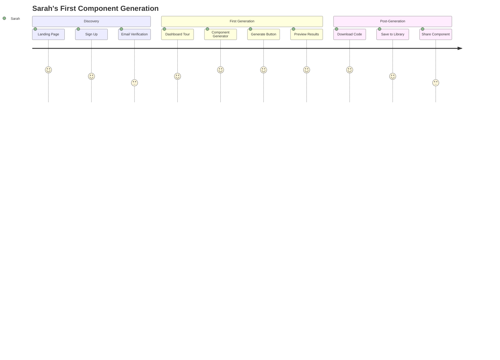
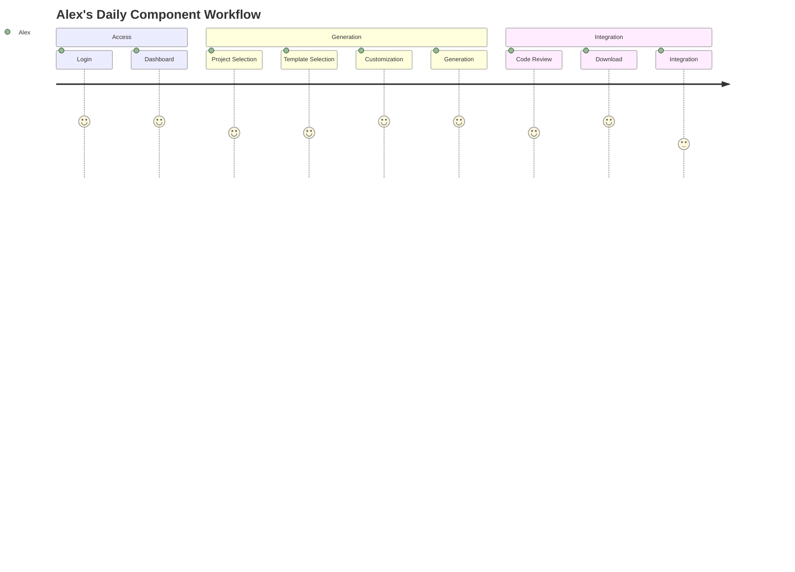
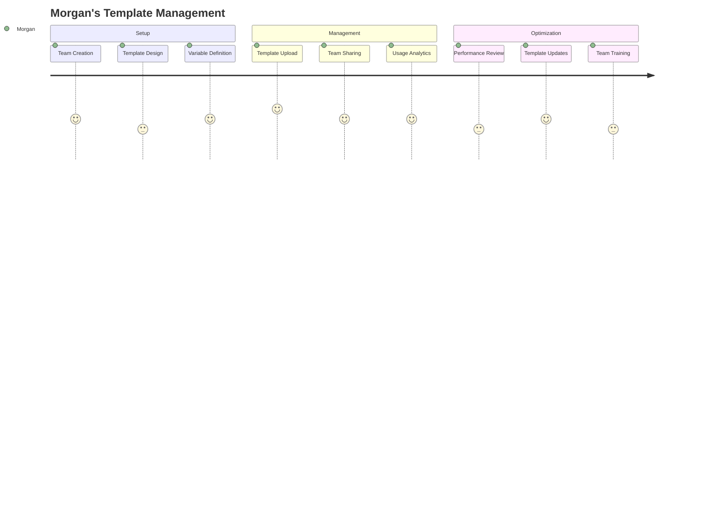
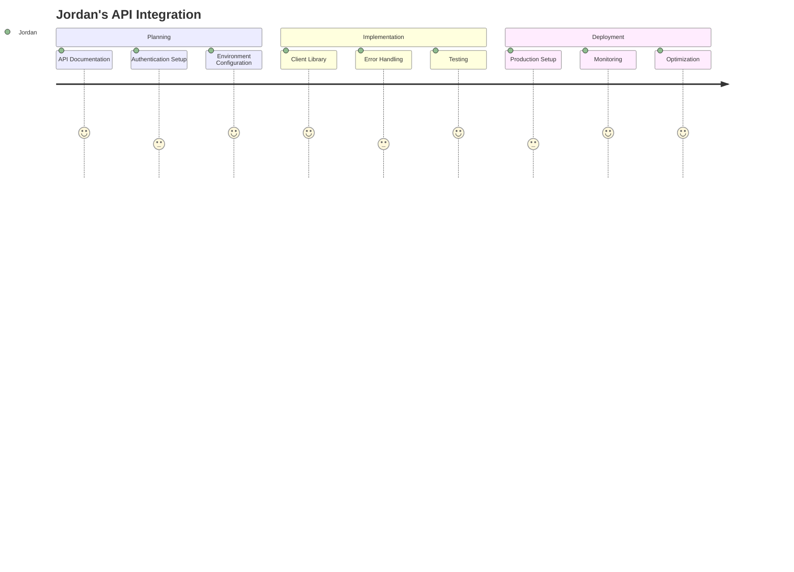
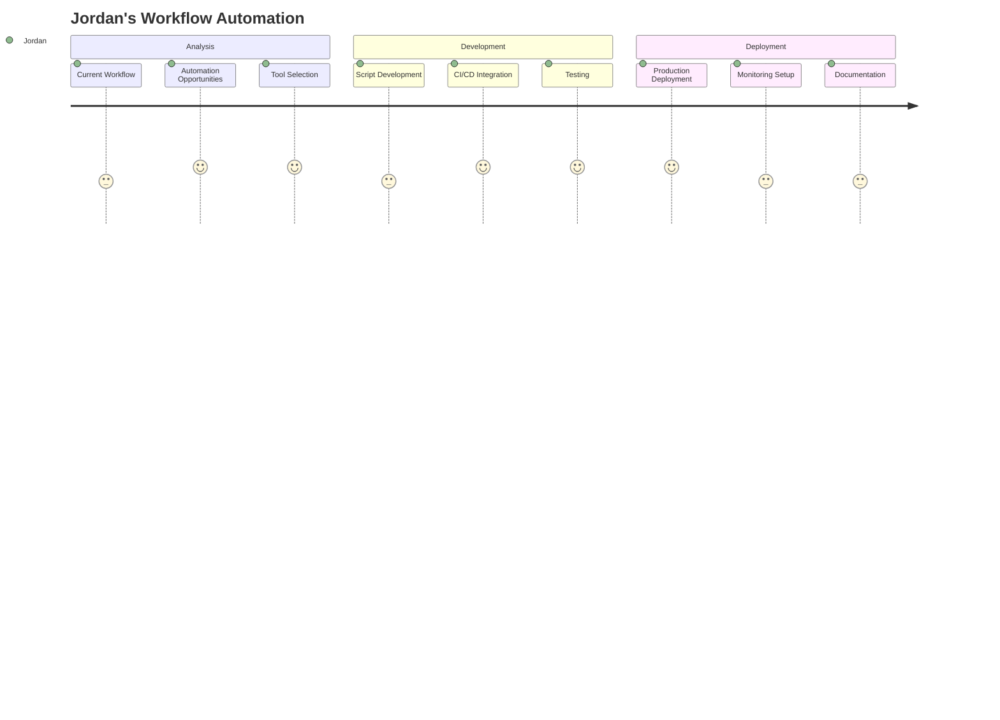
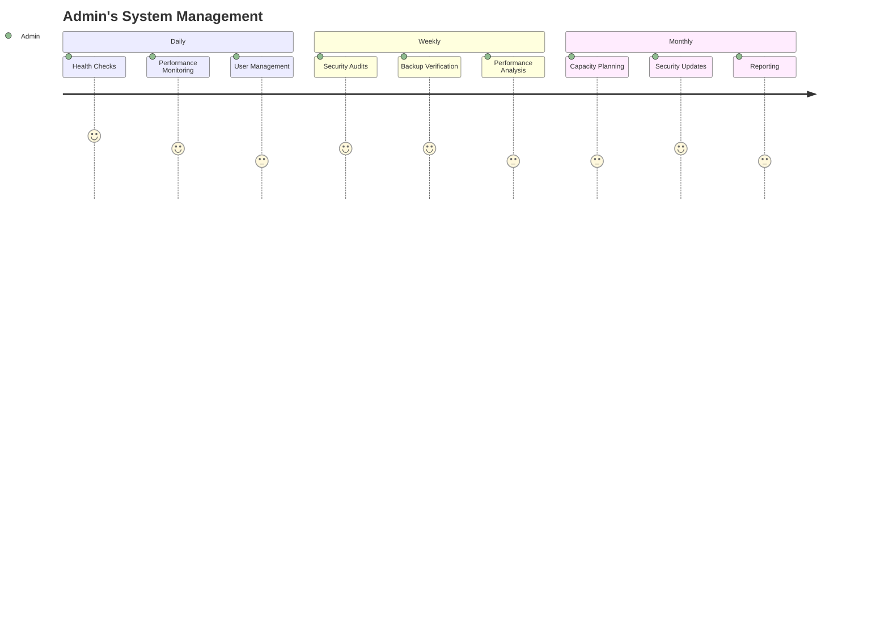
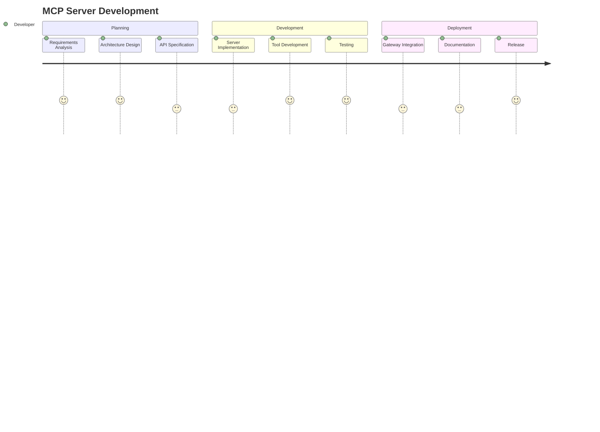

# UIForge Ecosystem User Journey Documentation

## 🎯 **Overview**

This document outlines the complete user journeys through the UIForge ecosystem,
from initial onboarding to advanced usage patterns. These journeys help
understand user interactions, pain points, and opportunities for improvement
across the three main components: WebApp, Gateway, and MCP Servers.

## 📋 **Table of Contents**

- [User Personas](#user-personas)
- [Core User Journeys](#core-user-journeys)
- [Advanced User Journeys](#advanced-user-journeys)
- [Administrator Journeys](#administrator-journeys)
- [Developer Journeys](#developer-journeys)
- [User Experience Metrics](#user-experience-metrics)
- [Journey Optimization](#journey-optimization)

## 👥 **User Personas**

### **Primary Personas**

#### **1. UI Designer - Sarah**

- **Role**: Frontend UI/UX Designer
- **Experience**: 5+ years in web design
- **Goals**: Rapidly prototype and generate UI components
- **Pain Points**: Time-consuming component creation, inconsistent design
  systems
- **Technical Level**: Moderate (HTML/CSS knowledge, limited JavaScript)

#### **2. Frontend Developer - Alex**

- **Role**: React/Vue Developer
- **Experience**: 3+ years in frontend development
- **Goals**: Accelerate development with reusable components
- **Pain Points**: Boilerplate code, maintaining consistency across projects
- **Technical Level**: High (TypeScript, React, modern tooling)

#### **3. Full-Stack Developer - Jordan**

- **Role**: Full-Stack Developer
- **Experience**: 7+ years in software development
- **Goals**: Integrate UI generation into existing workflows
- **Pain Points**: Context switching between design and development
- **Technical Level**: Expert (multiple frameworks, system architecture)

#### **4. Team Lead - Morgan**

- **Role**: Development Team Lead
- **Experience**: 10+ years in software development
- **Goals**: Standardize team's UI development process
- **Pain Points**: Inconsistent code quality, onboarding new developers
- **Technical Level**: High (architecture, team management)

#### **5. Product Manager - Casey**

- **Role**: Product Manager
- **Experience**: 6+ years in product management
- **Goals**: Faster prototyping and iteration cycles
- **Pain Points**: Long development cycles for UI changes
- **Technical Level**: Low to Moderate (understands concepts, not
  implementation)

## 🛤️ **Core User Journeys**

### **Journey 1: First-Time User Onboarding**

#### **User**: UI Designer Sarah

#### **Goal**: Generate first UI component

#### **Duration**: 15-20 minutes



#### **Step-by-Step Journey**

**1. Discovery & Sign Up (5 minutes)**

- Lands on UIForge homepage via Google search for "AI UI generator"
- Views feature highlights and component gallery
- Clicks "Get Started" button
- Completes sign-up form with email and password
- Receives verification email and confirms account

**2. Dashboard Orientation (3 minutes)**

- Lands on personalized dashboard
- Sees welcome tour with 3-step guide
- Views sample components in gallery
- Navigates to component generator

**3. First Component Generation (7 minutes)**

- Enters description: "Create a modern login form with email and password
  fields"
- Selects React framework and Modern style
- Clicks "Generate Component" button
- Waits for generation (typically 10-15 seconds)
- Views generated component with live preview
- Edits description to add "Remember me checkbox"
- Regenerates component with updated requirements

**4. Post-Generation Actions (5 minutes)**

- Downloads generated code as ZIP file
- Saves component to personal library
- Shares component link with colleague
- Explores additional features (templates, customization)

#### **Touchpoints & Interactions**

| Step         | Touchpoint        | Interaction        | Success Metric             |
| ------------ | ----------------- | ------------------ | -------------------------- |
| Discovery    | Homepage          | Browse features    | Time to sign-up < 2 min    |
| Sign Up      | Registration form | Create account     | Form completion rate > 80% |
| Verification | Email             | Confirm email      | Verification rate > 70%    |
| Dashboard    | Welcome tour      | Learn interface    | Tour completion > 60%      |
| Generation   | Component form    | Generate component | Success rate > 95%         |
| Results      | Preview screen    | View/download      | Download rate > 80%        |

#### **Pain Points & Solutions**

| Pain Point                 | Impact | Solution                           |
| -------------------------- | ------ | ---------------------------------- |
| Email verification delay   | Medium | Offer social login options         |
| Unclear component options  | High   | Interactive tooltips and examples  |
| Generation time anxiety    | Medium | Progress indicators and animations |
| Code integration confusion | High   | Integration guides and examples    |

### **Journey 2: Regular Component Generation**

#### **User**: Frontend Developer Alex

#### **Goal**: Generate components for project

#### **Duration**: 5-10 minutes per component



#### **Step-by-Step Journey**

**1. Quick Access (2 minutes)**

- Logs in with saved credentials
- Navigates to current project dashboard
- Views project-specific templates and settings

**2. Component Generation (6 minutes)**

- Selects appropriate template from project library
- Customizes component requirements in natural language
- Specifies framework-specific options (TypeScript, testing, etc.)
- Generates component with one click
- Reviews generated code and preview
- Makes iterative adjustments if needed

**3. Integration (2 minutes)**

- Downloads component code
- Integrates into existing project
- Tests component functionality
- Saves to project component library

#### **Optimization Opportunities**

- **Template Recommendations**: AI-powered template suggestions based on project
  context
- **Batch Generation**: Generate multiple related components simultaneously
- **Code Integration**: Direct IDE plugin for seamless integration
- **Version Control**: Automatic version tracking of generated components

### **Journey 3: Template Management**

#### **User**: Team Lead Morgan

#### **Goal**: Create and manage team templates

#### **Duration**: 30-45 minutes



#### **Step-by-Step Journey**

**1. Template Creation (15 minutes)**

- Accesses team management dashboard
- Creates new template from existing component
- Defines template variables and options
- Sets template metadata and categories
- Tests template with various inputs

**2. Team Configuration (10 minutes)**

- Invites team members to workspace
- Sets permissions and access levels
- Configures project-specific settings
- Establishes naming conventions

**3. Template Deployment (10 minutes)**

- Publishes template to team library
- Creates documentation and examples
- Monitors template usage and feedback
- Iterates based on team feedback

#### **Team Collaboration Features**

- **Shared Template Library**: Centralized repository for team templates
- **Version Control**: Track template changes and maintain history
- **Usage Analytics**: Monitor template adoption and effectiveness
- **Feedback System**: Collect and act on team feedback

## 🚀 **Advanced User Journeys**

### **Journey 4: API Integration**

#### **User**: Full-Stack Developer Jordan

#### **Goal**: Integrate UIForge into existing workflow

#### **Duration**: 2-3 hours



#### **Step-by-Step Journey**

**1. API Setup (45 minutes)**

- Reviews API documentation and endpoints
- Generates API keys and tokens
- Configures development environment
- Tests basic API connectivity

**2. Implementation (60 minutes)**

- Implements API client in preferred language
- Handles authentication and authorization
- Implements error handling and retry logic
- Creates wrapper functions for common operations

**3. Integration (45 minutes)**

- Integrates API calls into existing application
- Implements caching for performance
- Adds logging and monitoring
- Tests end-to-end functionality

#### **API Integration Examples**

```typescript
// Example: React Hook for Component Generation
import { useState, useCallback } from 'react';
import { useUIForgeAPI } from './useUIForgeAPI';

export const useComponentGeneration = () => {
  const [isGenerating, setIsGenerating] = useState(false);
  const [error, setError] = useState<string | null>(null);
  const { apiClient } = useUIForgeAPI();

  const generateComponent = useCallback(
    async (
      description: string,
      framework: string,
      options?: GenerationOptions
    ) => {
      setIsGenerating(true);
      setError(null);

      try {
        const result = await apiClient.generateComponent({
          description,
          framework,
          style: 'modern',
          options
        });
        return result;
      } catch (err) {
        setError(err instanceof Error ? err.message : 'Generation failed');
        throw err;
      } finally {
        setIsGenerating(false);
      }
    },
    [apiClient]
  );

  return {
    generateComponent,
    isGenerating,
    error
  };
};
```

### **Journey 5: Custom Workflow Automation**

#### **User**: Full-Stack Developer Jordan

#### **Goal**: Automate component generation pipeline

#### **Duration**: 4-6 hours



#### **Automation Examples**

```python
# Example: Automated Component Generation Script
import asyncio
import json
from pathlib import Path
from uiforge_client import UIForgeClient

class ComponentGenerator:
    def __init__(self, api_key: str):
        self.client = UIForgeClient(api_key=api_key)

    async def generate_from_config(self, config_file: str):
        """Generate components from configuration file."""
        with open(config_file, 'r') as f:
            config = json.load(f)

        for component_config in config['components']:
            try:
                component = await self.client.generate_component(
                    description=component_config['description'],
                    framework=component_config['framework'],
                    style=component_config.get('style', 'modern'),
                    options=component_config.get('options', {})
                )

                # Save component to file
                output_path = Path(component_config['output_path'])
                output_path.parent.mkdir(parents=True, exist_ok=True)

                with open(output_path, 'w') as f:
                    f.write(component.code)

                print(f"Generated: {component.name} -> {output_path}")

            except Exception as e:
                print(f"Error generating {component_config.get('name', 'unknown')}: {e}")

# Usage
async def main():
    generator = ComponentGenerator(api_key="your-api-key")
    await generator.generate_from_config("components.json")

if __name__ == "__main__":
    asyncio.run(main())
```

## 👨‍💼 **Administrator Journeys**

### **Journey 6: System Administration**

#### **User**: System Administrator

#### **Goal**: Manage and monitor UIForge deployment

#### **Duration**: Ongoing



#### **Administrative Tasks**

**1. System Monitoring**

- Monitor service health and performance
- Track user activity and system usage
- Analyze error rates and response times
- Set up alerts for critical issues

**2. User Management**

- Manage user accounts and permissions
- Handle support requests and issues
- Monitor compliance and security
- Generate usage reports

**3. Maintenance Operations**

- Apply security updates and patches
- Perform system backups and recovery
- Optimize performance and capacity
- Document system changes

## 🛠️ **Developer Journeys**

### **Journey 7: MCP Server Development**

#### **User**: MCP Server Developer

#### **Goal**: Develop custom MCP server

#### **Duration**: 1-2 weeks



#### **Development Workflow**

**1. Planning Phase (3-4 days)**

- Analyze requirements and use cases
- Design server architecture and APIs
- Create development roadmap
- Set up development environment

**2. Implementation Phase (5-7 days)**

- Implement MCP server core functionality
- Develop custom tools and capabilities
- Create comprehensive test suite
- Write documentation and examples

**3. Integration Phase (2-3 days)**

- Register server with gateway
- Test integration and compatibility
- Optimize performance and reliability
- Prepare for production deployment

## 📊 **User Experience Metrics**

### **Key Performance Indicators**

#### **Adoption Metrics**

- **User Registration Rate**: New users per week
- **Activation Rate**: Users who generate first component within 24 hours
- **Retention Rate**: Users returning within 7 days
- **Feature Adoption**: Usage of specific features

#### **Engagement Metrics**

- **Components Generated**: Total components per user
- **Session Duration**: Average time spent in application
- **Page Views**: Most visited pages and features
- **Conversion Rate**: Free to paid conversion

#### **Satisfaction Metrics**

- **Net Promoter Score (NPS)**: User satisfaction rating
- **Customer Support Tickets**: Issues and resolution time
- **User Feedback**: Qualitative feedback and suggestions
- **Error Rates**: Technical issues and failures

#### **Performance Metrics**

- **Generation Time**: Average component generation time
- **System Uptime**: Service availability percentage
- **Response Time**: API response times
- **Error Rates**: Failed requests and errors

### **Measurement Framework**

```typescript
// Analytics Tracking Implementation
interface UserEvent {
  userId?: string;
  sessionId: string;
  eventType: string;
  properties: Record<string, any>;
  timestamp: Date;
}

class AnalyticsTracker {
  async trackEvent(event: Omit<UserEvent, 'timestamp'>): Promise<void> {
    const userEvent: UserEvent = {
      ...event,
      timestamp: new Date()
    };

    // Send to analytics service
    await this.analyticsService.track(userEvent);

    // Update local metrics
    this.updateMetrics(userEvent);
  }

  async trackComponentGeneration(
    userId: string,
    componentType: string,
    generationTime: number,
    success: boolean
  ): Promise<void> {
    await this.trackEvent({
      userId,
      eventType: 'component_generated',
      properties: {
        componentType,
        generationTime,
        success,
        framework: this.getUserFramework(userId)
      }
    });
  }

  async trackUserJourney(
    userId: string,
    journeyType: string,
    step: string,
    completed: boolean
  ): Promise<void> {
    await this.trackEvent({
      userId,
      eventType: 'journey_step',
      properties: {
        journeyType,
        step,
        completed
      }
    });
  }
}
```

## 🎯 **Journey Optimization**

### **Optimization Strategies**

#### **1. Reduce Friction Points**

- **Simplify Onboarding**: Reduce steps from discovery to first generation
- **Improve Navigation**: Make key features more accessible
- **Streamline Workflows**: Eliminate unnecessary steps and clicks
- **Enhance Feedback**: Provide clear and immediate feedback

#### **2. Personalization**

- **Smart Recommendations**: Suggest relevant templates and options
- **Contextual Help**: Provide assistance based on user behavior
- **Customized Interface**: Adapt UI to user preferences and role
- **Progressive Disclosure**: Show advanced features as needed

#### **3. Automation**

- **Smart Defaults**: Pre-fill forms with intelligent defaults
- **Batch Operations**: Enable multiple actions simultaneously
- **Integration Options**: Connect with existing tools and workflows
- **Scheduled Tasks**: Automate repetitive operations

### **A/B Testing Framework**

```typescript
// A/B Testing Implementation
interface Experiment {
  id: string;
  name: string;
  variants: Variant[];
  trafficSplit: number[];
  startDate: Date;
  endDate?: Date;
}

interface Variant {
  id: string;
  name: string;
  config: Record<string, any>;
  weight: number;
}

class ExperimentManager {
  async getVariant(experimentId: string, userId: string): Promise<Variant> {
    const experiment = await this.getExperiment(experimentId);

    // Check if user is in experiment
    if (!this.isUserInExperiment(userId, experiment)) {
      return experiment.variants[0]; // Control group
    }

    // Assign variant based on user hash
    const userHash = this.hashUser(userId);
    const variantIndex = this.assignVariant(userHash, experiment.trafficSplit);

    return experiment.variants[variantIndex];
  }

  async trackConversion(
    experimentId: string,
    userId: string,
    variantId: string,
    conversionType: string
  ): Promise<void> {
    await this.analytics.track({
      eventType: 'experiment_conversion',
      properties: {
        experimentId,
        userId,
        variantId,
        conversionType
      }
    });
  }
}
```

### **Continuous Improvement Process**

1. **Data Collection**: Gather quantitative and qualitative data
2. **Analysis**: Identify patterns, trends, and pain points
3. **Hypothesis Formation**: Create testable improvement hypotheses
4. **Experimentation**: Run A/B tests and pilot programs
5. **Implementation**: Roll out successful changes
6. **Monitoring**: Track impact and iterate

---

_This user journey documentation serves as a living document that should be
updated regularly based on user feedback, analytics data, and system evolution._
